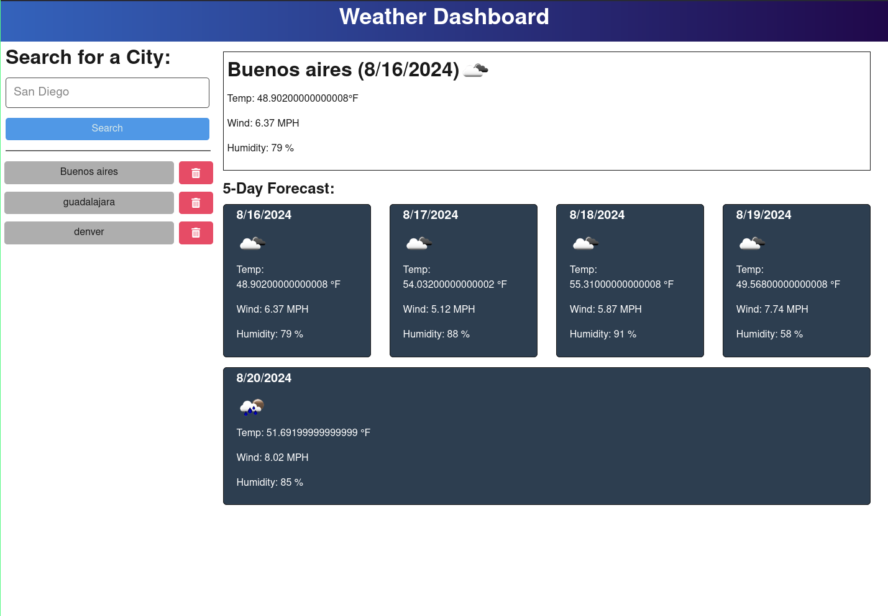

# Weather App

## Description
This is a full-stack app where you can search for the weather of a city and will also give you the forecast for the next 5 days.

- Link to the deployed [Weather App](https://weatherapp-2dkx.onrender.com)

## Table of Contents
- [Installation](#installation)
- [Usage](#usage)
- [How to Contribute](#how-to-contribute)
- [Questions](#questions)
- [Authors and acknowledgment](#authors-and-acknowledgment)
- [License](#license)

## Installation
run npm -i to install required packages 

## Usage
run npm start to run the app

features:
- Search for any city
- Save search history
- hability to delete elements of search history

## How to Contribute
To contribute create a branch and open a pull request commenting the changes you want to implement

## Questions
You can reach me for questions at [gihub profile](https://github.com/marioxabel)

## Authors and acknowledgment
- Author: [Mario](https://github.com/marioxabel)
- This was a challenge for the [Tecnológico de Monterrey Coding Boot Camp](https://bootcamp.tec.mx/coding/) and boilerplate was provided.

## License
Distributed under the MIT License. [Click to see the full MIT license](https://choosealicense.com/licenses/MIT/).
